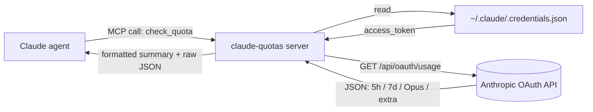

<div align="center">


<br />

<p>
  <a href="https://github.com/FruityMaxine/claude-quotas/stargazers"></a>
  <a href="https://github.com/FruityMaxine/claude-quotas/releases"></a>
  <a href="./LICENSE"></a>
  
  
</p>

<p>
  <a href="#-quick-start"><b>Quick start</b></a>
  &nbsp;·&nbsp;
  <a href="#-how-it-works"><b>How it works</b></a>
  &nbsp;·&nbsp;
  <a href="#-warning-thresholds"><b>Thresholds</b></a>
  &nbsp;·&nbsp;
  <a href="#-faq"><b>FAQ</b></a>
  &nbsp;·&nbsp;
  <a href="./README.zh-CN.md"><b>简体中文</b></a>
</p>

<br />

<p><i>A Claude Code plugin that gives Claude a self-introspection tool for its own subscription quota — so it can warn you <b>before</b> a long task runs out of budget, not after.</i></p>

</div>

---

## ✨ Why this exists

Claude Code enforces two rolling quotas: a **5-hour session window** and a **7-day weekly cap**. Hit either of them mid-task and the session stops cold — half-finished refactors, dead conversations, lost flow.

Today, the only way to know how much budget Claude has left is for *you* (the human) to ask Claude Code's UI. Claude itself, the agent doing the actual work, has **no idea** how close it is to the wall.

`claude-quotas` fixes that asymmetry. It's a Model Context Protocol (MCP) tool the agent can call **only when you ask**, returning real-time utilization for every quota window the Anthropic OAuth API exposes. The plugin is deliberately **quiet** — it doesn't poll, doesn't monitor, doesn't pop up unsolicited warnings. You ask, it answers.

> **TL;DR** — gives Claude the *ability* to see its quota. Whether it looks is up to you.

## 🎯 Features

- 🧠 **Self-introspection on demand** — Claude can read its own usage when *you* ask it to, not on its own schedule.
- 🤫 **Quiet by default** — no polling, no proactive warnings, no interrupting your task.
- 📊 **Every quota window** — 5-hour session, 7-day weekly, Opus weekly, Sonnet weekly, and pay-as-you-go extra usage.
- ⏱️ **Reset countdowns** — every window comes with a human-readable "resets in 2h 15m" string.
- 🪪 **Fine-grained plan detection** — uses the `rate_limit_tier` field from your local credentials, so it can distinguish `max_5x` from `max_20x` even though the API only returns coarse `pro` / `max`.
- 🔐 **Zero extra login** — reuses your existing Claude Code OAuth credentials in `~/.claude/.credentials.json`.
- 📦 **Single-file bundle** — pre-built with esbuild, no `npm install` required at install time.
- 🛒 **Marketplace ready** — repository ships its own `marketplace.json`, so two slash commands and you're in.

## ⚡ Quick start

```bash
# Inside any Claude Code session
/plugin marketplace add FruityMaxine/claude-quotas
/plugin install claude-quotas@claude-quotas
```

That's it. Claude now has a `check_quota` tool. Ask it:

> *"How much of my weekly budget is left?"*

…and Claude will call the tool and summarise. If you don't ask, it stays out of your way — by design.

> **Want a stricter pre-flight check?** You can tell Claude *"check my quota before starting this migration"* in a specific session. The plugin won't do this on its own initiative.

## 📺 What you (and Claude) get back

```text
5-hour session: 38% used | resets in 2h 15m
7-day weekly:   87% used | resets in 3d 4h
Plan:           max 5x
```

Plus a structured JSON payload with every raw field — `utilization`, `resets_at` (ISO 8601), `subscription_type`, `rate_limit_tier`, per-model windows, `extra_usage` — so Claude can reason over it programmatically.

## 🛠️ Installation options

<details>
<summary><b>Option A — Marketplace (recommended)</b></summary>

```bash
/plugin marketplace add FruityMaxine/claude-quotas
/plugin install claude-quotas@claude-quotas
```

Two commands, no clones, automatic updates via `/plugin marketplace update`.
</details>

<details>
<summary><b>Option B — Direct GitHub install</b></summary>

```bash
/plugin install github:FruityMaxine/claude-quotas
```

Skips the marketplace step. Use this if you only want this one plugin and don't care about a catalog entry.
</details>

<details>
<summary><b>Option C — Local development</b></summary>

```bash
git clone https://github.com/FruityMaxine/claude-quotas.git
cd claude-quotas
npm install && npm run build
claude --plugin-dir ./
```

The `--plugin-dir` flag loads the plugin from disk, so you can iterate on `src/index.ts` and rerun without publishing.
</details>

## 🔍 How it works



1. The plugin registers an MCP server (`claude-quotas`) that exposes a single tool: `check_quota`.
2. When Claude calls it, the server reads the OAuth credentials Claude Code already wrote during `claude login`.
3. It hits the (undocumented but stable) `GET https://api.anthropic.com/api/oauth/usage` endpoint with the `anthropic-beta: oauth-2025-04-20` header.
4. The response is shaped into both a one-liner summary and a structured JSON object, then handed back to Claude.

> **No new credentials, no extra config, no telemetry.** Your token never leaves your machine; the only outbound request is to `api.anthropic.com`.

## 🤫 Quiet by design

Most "quota tracker" plugins fail by being too eager — they poll on a timer, interrupt your work to announce 73% is now 74%, or start every task with an unsolicited budget speech. This one doesn't.

The skill that ships with the plugin instructs Claude to:

- **Only invoke `check_quota` when you explicitly ask** ("check my quota", "how much is left", "check before starting X"). No proactive polling.
- **Never interrupt the current task** to surface quota state you didn't request.
- **Treat tool errors as silent** — if your token expired or the network is dead, Claude doesn't pivot the conversation to debug it; it just skips and keeps going. You'll only hear about it if you actually asked for a quota check.
- **At most one short courtesy line** if you *did* ask and the result happens to be ≥ 90%. No multi-paragraph warnings, no "should we pause?" detours.

If you'd rather the plugin be louder, edit [`skills/check-quota/SKILL.md`](./skills/check-quota/SKILL.md) — the entire policy lives there in plain English.

> **API note:** utilization is already normalized per plan, so 80% means "80% of *your* plan's budget" whether you're on Pro, Max 5x, or Max 20x. There's no need for tier-specific thresholds — a single soft "≥ 90%" line is plenty.

## 🧩 What's in the tool response

| Field | Type | Description |
|:----- |:---- |:----------- |
| `subscription_type` | `string` | Coarse plan from the API: `pro` or `max`. |
| `rate_limit_tier` | `string \| null` | Fine-grained tier from local credentials (e.g. `default_claude_max_5x`, `default_claude_max_20x`). Use this when you need to distinguish Max 5x from Max 20x — the API itself doesn't tell you. |
| `five_hour.utilization` | `number` (0–100) | % of the 5-hour session used |
| `five_hour.resets_at` | `string` (ISO 8601) | When the 5-hour window resets |
| `seven_day.utilization` | `number` (0–100) | % of the 7-day weekly cap used |
| `seven_day.resets_at` | `string` (ISO 8601) | When the weekly window resets |
| `seven_day_opus` | `object \| null` | Opus-specific weekly window. Often `null` on plans without a separate Opus pool. |
| `seven_day_sonnet` | `object \| null` | Sonnet-specific weekly window. Often inactive (utilization 0, resets_at null) when no separate Sonnet pool exists. |
| `extra_usage` | `object \| null` | Pay-as-you-go credit status |
| `summary` | `string` | Pre-formatted multi-line human-readable summary |

## 🔐 Privacy & security

- Reads **only** your local `~/.claude/.credentials.json` (or whatever `CLAUDE_CONFIG_DIR` points at).
- Sends **one** outbound request, to `api.anthropic.com`, identical to what Claude Code itself sends.
- Stores **nothing** — no cache, no log file, no analytics.
- Source is ~150 lines of TypeScript. Auditable in one sitting; see [`src/index.ts`](./src/index.ts).

## ❓ FAQ

**Q: Why a tool for the agent instead of a UI for me?**
Because Claude Code already shows you the numbers in its own UI. The agent is the one who needed help — it was operating blind. This plugin closes that loop.

**Q: Does this use a public API?**
No. The OAuth usage endpoint is undocumented. It is, however, the same endpoint Claude Code itself uses. If Anthropic ever ships an official one, this plugin will move to it.

**Q: Will my credentials leak?**
The token only travels to `api.anthropic.com` over TLS, exactly as it does for normal Claude Code traffic. No third-party servers are involved.

**Q: What if my token is expired?**
The tool returns a non-blocking message and Claude is instructed to **silently skip** rather than interrupt your task. You'll only see the error if you explicitly asked to check quota. Run `claude login` whenever convenient.

**Q: Will Claude pop up quota warnings while I'm working?**
No. The skill explicitly forbids unsolicited quota commentary. Claude only checks when *you* ask, and only adds an extra one-line heads-up if your weekly or session window is already ≥ 90% — and only after you asked. See [Quiet by design](#-quiet-by-design).

**Q: I want it louder / quieter / customised.**
The whole policy is plain English in [`skills/check-quota/SKILL.md`](./skills/check-quota/SKILL.md). Bump the threshold, remove the courtesy line, or rewrite the whole thing — fork-friendly.

**Q: Why does it say `Plan: max` when I'm actually on Max 5x?**
The API only returns coarse `pro` / `max`. The plugin reads `rate_limit_tier` from your local `~/.claude/.credentials.json` to recover the precise tier (`max_5x` / `max_20x`). The summary line will show the fine-grained value automatically.

## 🗺️ Roadmap

- [ ] Optional notification hook when crossing a configurable threshold
- [ ] Localized summaries (the JSON is universal; only the one-liner is English)
- [ ] Per-project usage history via `${CLAUDE_PLUGIN_DATA}`
- [ ] Add a slash command (`/quota`) for human-initiated checks

PRs welcome. See [Contributing](#-contributing).

## 🤝 Contributing

Issues, ideas, and pull requests are all welcome.

```bash
git clone https://github.com/FruityMaxine/claude-quotas.git
cd claude-quotas
npm install
npm run typecheck
npm run build
claude --plugin-dir ./
```

The whole plugin is one TypeScript file. If you can read JSON and write a regex, you can ship a feature here.

## 📜 License

[MIT](./LICENSE) © [FruityMaxine](https://github.com/FruityMaxine)

## 👤 Author

Built by **[FruityMaxine](https://github.com/FruityMaxine)** — because watching a 30-minute refactor die at 99% utilization is worse than not starting it.

<div align="center">

<br />

<sub>If this saved you a session, a ⭐ on the repo is the cheapest way to say thanks.</sub>

</div>
