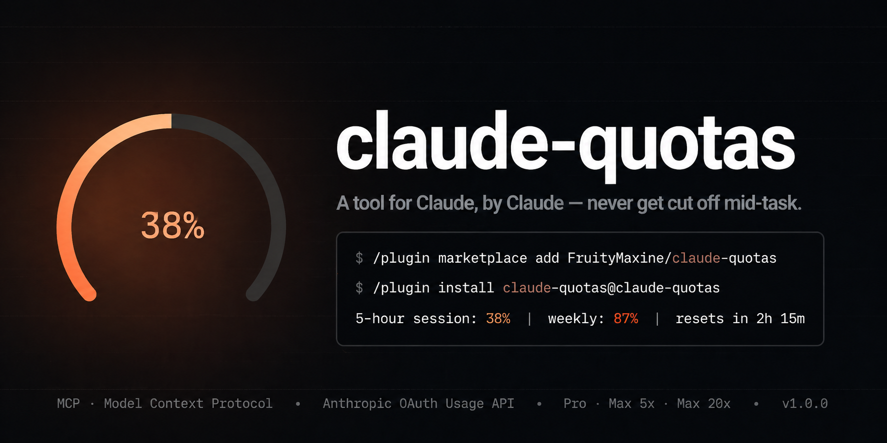
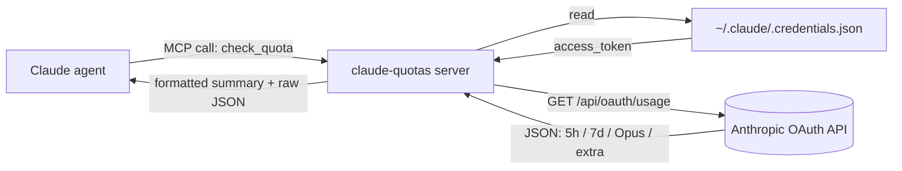

<div align="center">



<br />

<p>
  <a href="https://github.com/FruityMaxine/claude-quotas/stargazers"></a>
  <a href="https://github.com/FruityMaxine/claude-quotas/releases"></a>
  <a href="./LICENSE"></a>
  
  
</p>

<p>
  <a href="#-quick-start"><b>Quick start</b></a>
  &nbsp;·&nbsp;
  <a href="#-how-it-works"><b>How it works</b></a>
  &nbsp;·&nbsp;
  <a href="#%EF%B8%8F-vigilant-by-design"><b>Policy</b></a>
  &nbsp;·&nbsp;
  <a href="#-comparison-with-similar-tools"><b>Comparison</b></a>
  &nbsp;·&nbsp;
  <a href="#-faq"><b>FAQ</b></a>
  &nbsp;·&nbsp;
  <a href="./README.zh-CN.md"><b>简体中文</b></a>
</p>

<br />

<p><i>A Claude Code plugin that gives the Claude agent an MCP tool to read its own subscription quota during long tasks, plus a vigilance policy that gracefully wraps up and uses <code>ScheduleWakeup</code> to sleep through the 5-hour reset — so the agent does not hit the rate limit wall mid-work.</i></p>

</div>

---

## ✨ Why this exists

Claude Code enforces two rolling quotas: a **5-hour session window** and a **7-day weekly cap**. Hit either of them mid-task and the session stops cold — half-finished refactors, dead conversations, lost flow.

Today, the only way to know how much budget Claude has left is for *you* (the human) to ask Claude Code's UI. Claude itself, the agent doing the actual work, has **no idea** how close it is to the wall.

`claude-quotas` fixes that asymmetry. It's a Model Context Protocol (MCP) tool the agent uses **vigilantly** during multi-step tasks: take a baseline reading at the start, re-check as utilization grows, and — when crossing per-plan thresholds — gracefully wrap up the current unit, commit a checkpoint, and **`ScheduleWakeup`-sleep through the quota reset** instead of slamming into the wall mid-task.

> **TL;DR** — gives Claude the eyes to see its own quota *and* the discipline to ride out the reset, rather than dying in the middle of your refactor.

## 🎯 Features

- 🧠 **Self-introspection** — Claude reads its own usage at any point during a task, not just when you ask.
- 🛡️ **Vigilant by design** — not "quiet by default", not "noisy by default" — *measured*. Baseline at task start, re-check as the work progresses, act only at threshold zones.
- 💤 **Auto-sleep through the wall** — at the per-plan sleep threshold, Claude wraps up the current unit, commits a checkpoint, writes a resume note, and `ScheduleWakeup`s through the quota reset (with relay-sleeps for windows longer than the runtime's 1-hour cap). When you come back, the work is already continuing.
- 🤖 **`/loop`-aware** — knows that autonomous runs don't have a human at the keyboard, so it gets stricter (extra 1% safety margin) when it detects a loop context.
- 📊 **Every quota window** — 5-hour session, 7-day weekly, Opus weekly, Sonnet weekly, and pay-as-you-go extra usage.
- 🚦 **Tier-aware thresholds** — Pro alerts at 70%, Max 5x at 94%, Max 20x at 95% (5-hour window) — proportional to how fast each plan burns.
- ⏱️ **Either-window-can-kill-you logic** — the 5-hour and 7-day caps are independent ceilings; the policy always acts on the more severe of the two.
- 🪪 **Fine-grained plan detection** — uses the `rate_limit_tier` field from local credentials, so it can distinguish `max_5x` from `max_20x` even though the API only returns coarse `pro` / `max`.
- 🔐 **Zero extra login** — reuses your existing Claude Code OAuth credentials in `~/.claude/.credentials.json`.
- 📦 **Single-file bundle** — pre-built with esbuild, no `npm install` required at install time.
- 🛒 **Marketplace ready** — repository ships its own `marketplace.json`, so two slash commands and you're in.

## ⚡ Quick start

```bash
# Inside any Claude Code session
/plugin marketplace add FruityMaxine/claude-quotas
/plugin install claude-quotas@claude-quotas
```

That's it. Claude now has a `check_quota` tool plus a vigilance policy in the bundled skill. From this point on:

- For any non-trivial task, Claude takes a **baseline reading** at the start.
- It re-checks **periodically** during the work, calibrated by burn rate.
- If utilization crosses your plan's **alert zone**, it stays vigilant.
- If it crosses the **sleep zone**, it wraps up gracefully, commits, writes a resume note, and `ScheduleWakeup`-sleeps through the reset.
- For long autonomous runs (`/loop`), it lowers the trigger by an extra 1% as safety margin.

You can also just ask: *"how much of my weekly budget is left?"* and Claude will call the tool directly and answer.

## 📺 What you (and Claude) get back

```text
5-hour session: 38% used | resets in 2h 15m
7-day weekly:   87% used | resets in 3d 4h
Plan:           max 5x
```

Plus a structured JSON payload with every raw field — `utilization`, `resets_at` (ISO 8601), `subscription_type`, `rate_limit_tier`, per-model windows, `extra_usage` — so Claude can reason over it programmatically.

## 🛠️ Installation options

<details>
<summary><b>Option A — Marketplace (recommended)</b></summary>

```bash
/plugin marketplace add FruityMaxine/claude-quotas
/plugin install claude-quotas@claude-quotas
```

Two commands, no clones, automatic updates via `/plugin marketplace update`.
</details>

<details>
<summary><b>Option B — Direct GitHub install</b></summary>

```bash
/plugin install github:FruityMaxine/claude-quotas
```

Skips the marketplace step. Use this if you only want this one plugin and don't care about a catalog entry.
</details>

<details>
<summary><b>Option C — Local development</b></summary>

```bash
git clone https://github.com/FruityMaxine/claude-quotas.git
cd claude-quotas
npm install && npm run build
claude --plugin-dir ./
```

The `--plugin-dir` flag loads the plugin from disk, so you can iterate on `src/index.ts` and rerun without publishing.
</details>

## 🔍 How it works



1. The plugin registers an MCP server (`claude-quotas`) that exposes a single tool: `check_quota`.
2. When Claude calls it, the server reads the OAuth credentials Claude Code already wrote during `claude login`.
3. It hits the (undocumented but stable) `GET https://api.anthropic.com/api/oauth/usage` endpoint with the `anthropic-beta: oauth-2025-04-20` header.
4. The response is shaped into both a one-liner summary and a structured JSON object, then handed back to Claude.

> **No new credentials, no extra config, no telemetry.** Your token never leaves your machine; the only outbound request is to `api.anthropic.com`.

## 🛡️ Vigilant by design

Most "quota tracker" plugins fail in one of two ways: too eager (polling, interrupting, repeated nags) or too passive (the agent doesn't notice the wall coming until it hits it). This one aims for the middle: **measured vigilance** with concrete actions tied to concrete thresholds.

### The three zones

The skill defines three zones based on `utilization` (already-used %), per plan:

#### 5-hour window

| Plan | Alert zone | Sleep + Wrap-up zone |
|:-----|:-----------|:---------------------|
| **Pro**       | `utilization ≥ 70%` | `utilization ≥ 95%` |
| **Max 5x**    | `utilization ≥ 94%` | `utilization ≥ 98%` |
| **Max 20x**   | `utilization ≥ 95%` | `utilization ≥ 99%` |

#### 7-day window

| Plan | Alert zone | Wrap-up + STOP zone (no sleep) |
|:-----|:-----------|:-------------------------------|
| **Pro**       | `utilization ≥ 95%` | `utilization ≥ 99%` |
| **Max 5x**    | `utilization ≥ 98%` | `utilization ≥ 99.5%` |
| **Max 20x**   | `utilization ≥ 98%` | `utilization ≥ 99.5%` |

> The 7-day window can't be slept through — its reset is days away. So when it reaches the stop zone, Claude wraps up, writes a resume note, and reports back to you instead of trying to sleep.

### What happens at the sleep zone (5h)

When the 5-hour window crosses the per-plan sleep threshold, Claude does **all of this** in order, then ends the turn:

1. **Wraps up the current minimal complete unit of work.** No half-edited functions, no broken syntax, no missing braces. Maximize productive output up to the wall — but never leave the codebase in a non-compiling state.
2. **`git commit`s a checkpoint** (no push — pushing is a shared-state action).
3. **Writes a resume note** at `docs/progress/quota-resume.md` with: task summary, completed subtasks, the next concrete subtask (with file paths and line numbers), and any in-flight design context.
4. **`ScheduleWakeup`s** with `delaySeconds = secondsUntilReset` (capped at 3600s by runtime). On wake-up, Claude re-checks `check_quota`; if the window hasn't reset yet, it relay-sleeps another segment (up to 6 segments total).

When you come back, your task is either done or right where you left it — never a half-broken file with the agent stuck on a "use extra credits or wait?" dialog.

### Either-window-can-kill-you logic

Both windows are independent ceilings — crossing either one ends the session. So the skill always evaluates **both** windows on every check and acts on the **more severe** zone. Special case: if the 7d window is in the stop zone but 5h has room, **sleep is forbidden** (sleeping a few hours can't save a multi-day window).

### `/loop` awareness

In autonomous (`/loop`) contexts the user is typically away from the keyboard. Hitting the wall there pops a blocking dialog that does **not** auto-dismiss when the quota resets — meaning the loop is dead until the user comes back manually. To prevent this, the skill **lowers each sleep threshold by ~1%** when it detects a loop context. The cost of an extra 1% margin is much smaller than the cost of a dead overnight loop.

If you'd rather change the policy, edit [`skills/check-quota/SKILL.md`](./skills/check-quota/SKILL.md) — every threshold and every behaviour rule lives there in plain English.

## 🆚 Comparison with similar tools

`claude-quotas` sits at the intersection of three properties that, together, no other community tool currently offers: **agent-facing self-introspection**, **proactive avoidance before the wall**, and **automatic sleep across the reset**.

| Project | Audience | Active monitoring | Pre-wall avoidance | Post-wall recovery | `/loop` aware |
|--------|----------|-------------------|--------------------|--------------------|---------------|
| **claude-quotas (this project)** | Claude agent (MCP tool) | ✅ During tasks | ✅ ScheduleWakeup across reset | ✅ commit + resume note as fallback | ✅ extra 1% margin |
| [claude-code-limit-tracker](https://github.com/TylerGallenbeck/claude-code-limit-tracker) | Human (statusline) | ❌ | ❌ | ❌ | ❌ |
| [wakeclaude](https://github.com/rittikbasu/wakeclaude) | Human (TUI scheduler) | ❌ | ❌ | ✅ Re-fires prompt after reset | ❌ |
| [claude-wake-up](https://github.com/gaboe/claude-wake-up) | Keep window warm (cron) | ❌ | ❌ | ❌ | ❌ |
| [Claude Code Routines](https://code.claude.com/docs/en/desktop-scheduled-tasks) (official) | Cron-style session launch | ❌ | ❌ | ❌ | ❌ |

The community has solid coverage for **dashboards for humans**, **scheduled prompt launchers**, and **post-wall recovery**. What was missing was the agent itself reading its own budget mid-task and stepping over the reset before getting cut off — which is what this plugin does.

## 🧩 What's in the tool response

| Field | Type | Description |
|:----- |:---- |:----------- |
| `subscription_type` | `string` | Coarse plan from the API: `pro` or `max`. |
| `rate_limit_tier` | `string \| null` | Fine-grained tier from local credentials (e.g. `default_claude_max_5x`, `default_claude_max_20x`). Use this when you need to distinguish Max 5x from Max 20x — the API itself doesn't tell you. |
| `five_hour.utilization` | `number` (0–100) | % of the 5-hour session used |
| `five_hour.resets_at` | `string` (ISO 8601) | When the 5-hour window resets |
| `seven_day.utilization` | `number` (0–100) | % of the 7-day weekly cap used |
| `seven_day.resets_at` | `string` (ISO 8601) | When the weekly window resets |
| `seven_day_opus` | `object \| null` | Opus-specific weekly window. Often `null` on plans without a separate Opus pool. |
| `seven_day_sonnet` | `object \| null` | Sonnet-specific weekly window. Often inactive (utilization 0, resets_at null) when no separate Sonnet pool exists. |
| `extra_usage` | `object \| null` | Pay-as-you-go credit status |
| `summary` | `string` | Pre-formatted multi-line human-readable summary |

## 🔐 Privacy & security

- Reads **only** your local `~/.claude/.credentials.json` (or whatever `CLAUDE_CONFIG_DIR` points at).
- Sends **one** outbound request, to `api.anthropic.com`, identical to what Claude Code itself sends.
- Stores **nothing** — no cache, no log file, no analytics.
- Source is ~150 lines of TypeScript. Auditable in one sitting; see [`src/index.ts`](./src/index.ts).

## ❓ FAQ

**Q: Why a tool for the agent instead of a UI for me?**
Because Claude Code already shows you the numbers in its own UI. The agent is the one who needed help — it was operating blind. This plugin closes that loop.

**Q: Does this use a public API?**
No. The OAuth usage endpoint is undocumented. It is, however, the same endpoint Claude Code itself uses. If Anthropic ever ships an official one, this plugin will move to it.

**Q: Will my credentials leak?**
The token only travels to `api.anthropic.com` over TLS, exactly as it does for normal Claude Code traffic. No third-party servers are involved.

**Q: What if my token is expired?**
The tool returns a non-blocking message and the skill instructs Claude to **silently skip** rather than interrupt your task. You'll only see the error if you explicitly asked for a quota check. Run `claude login` whenever convenient.

**Q: Will Claude blast me with quota warnings while I'm working?**
No. Vigilance ≠ noise. Claude takes silent baseline readings and re-checks during work, but only takes visible action at threshold zones. In Alert zone, at most a single short transition note. At the Sleep zone, the wrap-up sequence speaks for itself.

**Q: What if `ScheduleWakeup` doesn't fire?**
That's why the wrap-up sequence does **all three**: commit + resume note + ScheduleWakeup. Even if the wake-up fails (system reboot, session ended, etc.), you have a clean commit and a `docs/progress/quota-resume.md` you can hand back to Claude with "continue from here". The wake-up is an optimization, not a single point of failure.

**Q: I want different thresholds / different behaviour.**
The whole policy is plain English in [`skills/check-quota/SKILL.md`](./skills/check-quota/SKILL.md). Edit the threshold tables, change the wrap-up steps, disable the loop-strictness bump — fork-friendly.

**Q: Why does it say `Plan: max` when I'm actually on Max 5x?**
The API only returns coarse `pro` / `max`. The plugin reads `rate_limit_tier` from your local `~/.claude/.credentials.json` to recover the precise tier (`max_5x` / `max_20x`). The summary line shows the fine-grained value automatically.

## 🗺️ Roadmap

- [ ] Optional notification hook when crossing a configurable threshold
- [ ] Localized summaries (the JSON is universal; only the one-liner is English)
- [ ] Per-project usage history via `${CLAUDE_PLUGIN_DATA}`
- [ ] Add a slash command (`/quota`) for human-initiated checks

PRs welcome. See [Contributing](#-contributing).

## 🤝 Contributing

Issues, ideas, and pull requests are all welcome.

```bash
git clone https://github.com/FruityMaxine/claude-quotas.git
cd claude-quotas
npm install
npm run typecheck
npm run build
claude --plugin-dir ./
```

The whole plugin is one TypeScript file. If you can read JSON and write a regex, you can ship a feature here.

## 📜 License

[MIT](./LICENSE) © [FruityMaxine](https://github.com/FruityMaxine)

## 👤 Author

Built by [FruityMaxine](https://github.com/FruityMaxine). If the plugin saved you a session, a ⭐ on the repo is the simplest way to say thanks.

---

<sub>**Keywords**: claude code, claude code plugin, claude code mcp, claude code rate limit, claude code 5 hour limit, claude code weekly limit, claude code quota, claude code auto resume, claude code schedule wakeup, claude code /loop, claude code vigilance, anthropic oauth usage api, claude-quotas marketplace</sub>
