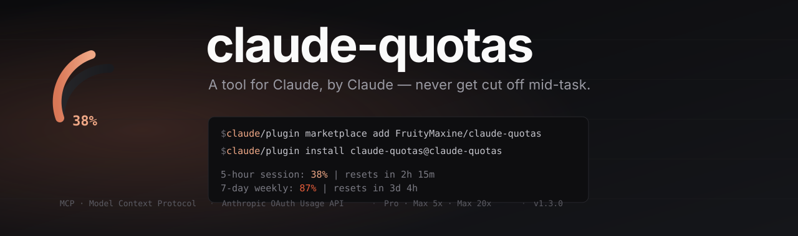
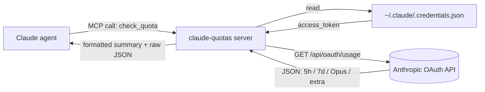

<div align="center">



<br />

<p>
  <a href="https://github.com/FruityMaxine/claude-quotas/stargazers"></a>
  <a href="https://github.com/FruityMaxine/claude-quotas/releases"></a>
  <a href="./LICENSE"></a>
  
  
</p>

<p>
  <a href="#-quick-start"><b>Quick start</b></a>
  &nbsp;·&nbsp;
  <a href="#-how-it-works"><b>How it works</b></a>
  &nbsp;·&nbsp;
  <a href="#-warning-thresholds"><b>Thresholds</b></a>
  &nbsp;·&nbsp;
  <a href="#-faq"><b>FAQ</b></a>
  &nbsp;·&nbsp;
  <a href="./README.zh-CN.md"><b>简体中文</b></a>
</p>

<br />

<p><i>A Claude Code plugin that gives Claude a self-introspection tool for its own subscription quota — so it can warn you <b>before</b> a long task runs out of budget, not after.</i></p>

</div>

---

## ✨ Why this exists

Claude Code enforces two rolling quotas: a **5-hour session window** and a **7-day weekly cap**. Hit either of them mid-task and the session stops cold — half-finished refactors, dead conversations, lost flow.

Today, the only way to know how much budget Claude has left is for *you* (the human) to ask Claude Code's UI. Claude itself, the agent doing the actual work, has **no idea** how close it is to the wall.

`claude-quotas` fixes that asymmetry. It's a Model Context Protocol (MCP) tool the agent can call on its own, returning real-time utilization for every quota window the Anthropic OAuth API exposes. With this installed, Claude can:

- glance at remaining budget **before kicking off a long task**,
- raise a flag when utilization crosses a tier-aware threshold,
- recommend pausing or batching when a wall is in sight.

> **TL;DR** — built so Claude doesn't run itself off a cliff.

## 🎯 Features

- 🧠 **Self-introspection** — Claude can query its own usage at will, no human in the loop.
- 📊 **All four quota dimensions** — 5-hour session, 7-day weekly, 7-day Opus, and pay-as-you-go extra usage.
- ⏱️ **Reset countdowns** — every window comes with a human-readable "resets in 2h 15m" string.
- 🪪 **Tier-aware thresholds** — built-in warning levels for `pro`, `max_5x`, and `max_20x` plans.
- 🔐 **Zero extra login** — reuses your existing Claude Code OAuth credentials in `~/.claude/.credentials.json`.
- 📦 **Single-file bundle** — pre-built with esbuild, no `npm install` required at install time.
- 🛒 **Marketplace ready** — repository ships its own `marketplace.json`, so two slash commands and you're in.

## ⚡ Quick start

```bash
# Inside any Claude Code session
/plugin marketplace add FruityMaxine/claude-quotas
/plugin install claude-quotas@claude-quotas
```

That's it. Claude now has a `check_quota` tool. Ask it:

> *"How much of my weekly budget is left?"*

…and Claude will call the tool, then summarise. Or instruct Claude to **always** call `check_quota` before starting any multi-step plan.

## 📺 What you (and Claude) get back

```text
5-hour session: 38% used | resets in 2h 15m
7-day weekly:   87% used | resets in 3d  4h
7-day Opus:     12% used | resets in 3d  4h
Subscription:   max_5x
```

Plus a structured JSON payload with every raw field — `utilization`, `resets_at` (ISO 8601), `subscription_type`, `extra_usage` — so Claude can reason over it programmatically.

## 🛠️ Installation options

<details>
<summary><b>Option A — Marketplace (recommended)</b></summary>

```bash
/plugin marketplace add FruityMaxine/claude-quotas
/plugin install claude-quotas@claude-quotas
```

Two commands, no clones, automatic updates via `/plugin marketplace update`.
</details>

<details>
<summary><b>Option B — Direct GitHub install</b></summary>

```bash
/plugin install github:FruityMaxine/claude-quotas
```

Skips the marketplace step. Use this if you only want this one plugin and don't care about a catalog entry.
</details>

<details>
<summary><b>Option C — Local development</b></summary>

```bash
git clone https://github.com/FruityMaxine/claude-quotas.git
cd claude-quotas
npm install && npm run build
claude --plugin-dir ./
```

The `--plugin-dir` flag loads the plugin from disk, so you can iterate on `src/index.ts` and rerun without publishing.
</details>

## 🔍 How it works



1. The plugin registers an MCP server (`claude-quotas`) that exposes a single tool: `check_quota`.
2. When Claude calls it, the server reads the OAuth credentials Claude Code already wrote during `claude login`.
3. It hits the (undocumented but stable) `GET https://api.anthropic.com/api/oauth/usage` endpoint with the `anthropic-beta: oauth-2025-04-20` header.
4. The response is shaped into both a one-liner summary and a structured JSON object, then handed back to Claude.

> **No new credentials, no extra config, no telemetry.** Your token never leaves your machine; the only outbound request is to `api.anthropic.com`.

## 🚦 Warning thresholds

The skill instructs Claude to raise a flag when utilization crosses tier-appropriate levels:

| Subscription | Warn at | Remaining headroom |
|:------------ |:------- |:-------------------|
| `pro`        | ≥ 80%   | ≤ 20%              |
| `max_5x`     | ≥ 96%   | ≤ 4%               |
| `max_20x`    | ≥ 98%   | ≤ 2%               |

Reasoning: a Pro user with 20% headroom may already be one big refactor away from the wall. A Max 20x user has roughly 5× more budget per percentage point, so the meaningful "danger zone" sits much closer to the ceiling.

## 🧩 What's in the tool response

| Field | Type | Description |
|:----- |:---- |:----------- |
| `subscription_type` | `string` | One of `pro`, `max_5x`, `max_20x`, etc. |
| `five_hour.utilization` | `number` (0–100) | % of the 5-hour session used |
| `five_hour.resets_at` | `string` (ISO 8601) | When the 5-hour window resets |
| `seven_day.utilization` | `number` (0–100) | % of the 7-day weekly cap used |
| `seven_day.resets_at` | `string` (ISO 8601) | When the weekly window resets |
| `seven_day_opus` | `object \| null` | Opus-specific weekly quota (Max plans) |
| `extra_usage` | `object \| null` | Pay-as-you-go credit status |
| `summary` | `string` | Human-readable multi-line summary |

## 🔐 Privacy & security

- Reads **only** your local `~/.claude/.credentials.json` (or whatever `CLAUDE_CONFIG_DIR` points at).
- Sends **one** outbound request, to `api.anthropic.com`, identical to what Claude Code itself sends.
- Stores **nothing** — no cache, no log file, no analytics.
- Source is ~150 lines of TypeScript. Auditable in one sitting; see [`src/index.ts`](./src/index.ts).

## ❓ FAQ

**Q: Why a tool for the agent instead of a UI for me?**
Because Claude Code already shows you the numbers in its own UI. The agent is the one who needed help — it was operating blind. This plugin closes that loop.

**Q: Does this use a public API?**
No. The OAuth usage endpoint is undocumented. It is, however, the same endpoint Claude Code itself uses. If Anthropic ever ships an official one, this plugin will move to it.

**Q: Will my credentials leak?**
The token only travels to `api.anthropic.com` over TLS, exactly as it does for normal Claude Code traffic. No third-party servers are involved.

**Q: What if my token is expired?**
The tool returns a polite error asking you to run `claude login`. It does not attempt to refresh on your behalf — that's Claude Code's job.

**Q: Can I disable the warning thresholds?**
Yes — they live in [`skills/check-quota/SKILL.md`](./skills/check-quota/SKILL.md). Edit, fork, or strip them out entirely.

## 🗺️ Roadmap

- [ ] Optional notification hook when crossing a configurable threshold
- [ ] Localized summaries (the JSON is universal; only the one-liner is English)
- [ ] Per-project usage history via `${CLAUDE_PLUGIN_DATA}`
- [ ] Add a slash command (`/quota`) for human-initiated checks

PRs welcome. See [Contributing](#-contributing).

## 🤝 Contributing

Issues, ideas, and pull requests are all welcome.

```bash
git clone https://github.com/FruityMaxine/claude-quotas.git
cd claude-quotas
npm install
npm run typecheck
npm run build
claude --plugin-dir ./
```

The whole plugin is one TypeScript file. If you can read JSON and write a regex, you can ship a feature here.

## 📜 License

[MIT](./LICENSE) © [FruityMaxine](https://github.com/FruityMaxine)

## 👤 Author

Built by **[FruityMaxine](https://github.com/FruityMaxine)** — because watching a 30-minute refactor die at 99% utilization is worse than not starting it.

<div align="center">

<br />

<sub>If this saved you a session, a ⭐ on the repo is the cheapest way to say thanks.</sub>

</div>
