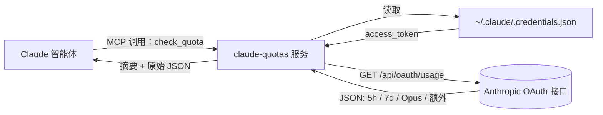

<div align="center">


<br />

<p>
  <a href="https://github.com/FruityMaxine/claude-quotas/stargazers"></a>
  <a href="https://github.com/FruityMaxine/claude-quotas/releases"></a>
  <a href="./LICENSE"></a>
  
  
</p>

<p>
  <a href="#-快速上手"><b>快速上手</b></a>
  &nbsp;·&nbsp;
  <a href="#-工作原理"><b>原理</b></a>
  &nbsp;·&nbsp;
  <a href="#-预警阈值"><b>预警阈值</b></a>
  &nbsp;·&nbsp;
  <a href="#-常见问题"><b>常见问题</b></a>
  &nbsp;·&nbsp;
  <a href="./README.md"><b>English</b></a>
</p>

<br />

<p><i>一个 Claude Code 插件，给 Claude 装上"自查额度"的能力。它能在长任务开工前提醒你额度告急，而不是等任务卡死在 99% 才哭。</i></p>

</div>

---

## ✨ 为什么要做这个

Claude Code 同时跑着两条滚动额度线：**5 小时会话窗口** 和 **7 天周封顶**。任何一条触顶，会话立刻断流——重构做了一半、对话戛然而止、心流彻底崩盘。

问题在于：当下唯一能看见剩余额度的，是用户你自己——通过 Claude Code 的界面查。**真正在干活的 Claude 自己反而完全看不到这条墙。** 它不知道自己离崩盘还有多远，自然也没法主动调整节奏。

`claude-quotas` 就是来填这个信息差的。它给 Claude 加了一个 MCP（Model Context Protocol）工具，**当你开口问的时候**，Claude 才会去查 Anthropic 的 OAuth 用量接口、拿回所有窗口的实时利用率。重点：这插件**默认沉默**——不轮询、不主动监控、不在你工作时跳出来打扰。你问，它才答。

> **一句话**：给 Claude 装一个"能看见额度"的能力。看不看，你说了算。

## 🎯 功能亮点

- 🧠 **按需自检** — 你让 Claude 查它才查，没有定时轮询。
- 🤫 **默认沉默** — 不主动监控、不主动报警、不打断你正在做的事。
- 📊 **覆盖每个窗口** — 5 小时会话、7 天周封顶、Opus 周专用、Sonnet 周专用，加上按量计费的额外用量。
- ⏱️ **重置倒计时** — 每个窗口都附带 "2h 15m 后重置" 这种人话格式。
- 🪪 **细分档位识别** — API 只给粗粒度的 `pro` / `max`，但插件会读取本地凭证里的 `rate_limit_tier`，自动还原 `max_5x` / `max_20x` 这种细分档位。
- 🔐 **零额外登录** — 直接复用 `~/.claude/.credentials.json` 里现成的 OAuth 凭证。
- 📦 **单文件分发** — 用 esbuild 预打包，安装后无需 `npm install`。
- 🛒 **市场即装即用** — 仓库自带 `marketplace.json`，两条斜杠命令完事。

## ⚡ 快速上手

```bash
# 在任意 Claude Code 会话里执行
/plugin marketplace add FruityMaxine/claude-quotas
/plugin install claude-quotas@claude-quotas
```

完事。Claude 现在多了一个 `check_quota` 工具。你可以直接问：

> *"我这周还剩多少额度？"*

Claude 会调用工具、整理结果给你。如果你不问，它就不会查——这是设计本意。

> **想要更严格的"出发前体检"？** 在某次具体任务里告诉 Claude *"开始这次重构前先帮我查一下额度"* 即可。但插件**不会自己**给你做这件事。

## 📺 你（和 Claude）能看到什么

```text
5-hour session: 38% used | resets in 2h 15m
7-day weekly:   87% used | resets in 3d 4h
Plan:           max 5x
```

除了这段易读摘要，工具还会回一份完整 JSON：`utilization` 百分比、`resets_at` ISO 8601 时间戳、`subscription_type` 粗档位、`rate_limit_tier` 细档位、各模型独立窗口、`extra_usage` 额外用量等等，方便 Claude 拿来做条件判断。

## 🛠️ 安装姿势

<details>
<summary><b>姿势 A — 通过插件市场（推荐）</b></summary>

```bash
/plugin marketplace add FruityMaxine/claude-quotas
/plugin install claude-quotas@claude-quotas
```

两条命令搞定，无需手动克隆。后续 `/plugin marketplace update` 一键拉新版本。
</details>

<details>
<summary><b>姿势 B — 直接从 GitHub 装单插件</b></summary>

```bash
/plugin install github:FruityMaxine/claude-quotas
```

跳过市场环节，适合"我就只想要这一个插件"的场景。
</details>

<details>
<summary><b>姿势 C — 本地开发模式</b></summary>

```bash
git clone https://github.com/FruityMaxine/claude-quotas.git
cd claude-quotas
npm install && npm run build
claude --plugin-dir ./
```

`--plugin-dir` 标志让 Claude Code 直接从硬盘加载插件，方便你改 `src/index.ts` 后即时验证。
</details>

## 🔍 工作原理



1. 插件起一个 MCP 服务（叫 `claude-quotas`），对外只暴露一个工具 `check_quota`。
2. Claude 调用时，服务从本地凭证文件读 `accessToken`——这文件是你 `claude login` 时 Claude Code 自己写下的。
3. 用 `anthropic-beta: oauth-2025-04-20` 头部去打 `GET https://api.anthropic.com/api/oauth/usage`（这接口未公开但稳定，是 Claude Code 自己也在用的那个）。
4. 把返回的原始数据整理成两份：一份人话摘要 + 一份结构化 JSON，回给 Claude。

> **没有新凭证、没有新配置、不收任何遥测。** Token 不出本机；唯一的外网请求就是访问 `api.anthropic.com`。

## 🤫 默认沉默是设计原则

市面上大部分"额度追踪器"插件都死在过度殷勤——定时轮询、73% 涨到 74% 也要打断你来播报、每个任务开始前先来一段"预算演讲"。**这个插件不一样**。

随包附带的 SKILL 明文规定 Claude 必须做到：

- **只在你明确开口时才调** `check_quota`（"查一下额度"、"还剩多少"、"开始 X 之前先查一下"），**绝不主动轮询**。
- **不打断当前任务**——你没让查的额度，它就不会主动汇报。
- **错误一律静默**——Token 过期、网络抽风、API 503，Claude 都不会调头去和你 debug 这事；它会跳过、继续干你交代的活。除非你**确实**点名要查额度，否则你压根不会看到这些错误。
- **最多一句体贴提醒**——只有当你**已经主动问了**额度、且结果恰好 ≥ 90% 时，Claude 可以加一句"（顺便提一下，周额度快满了）"。**没有长篇大论，没有"要不要暂停？"的偏题对话。**

如果你想让它更聒噪、或者自定义报警门槛，全部规则都在 [`skills/check-quota/SKILL.md`](./skills/check-quota/SKILL.md) 这一份纯文本里，一改即生效。

> **API 备注**：百分比已经按用户档位归一化——80% 对所有档位都是"你这档位预算的 80%"。所以不用搞分档报警门槛，单一软阈值（≥ 90%）就够用。

## 🧩 工具返回的字段

| 字段 | 类型 | 说明 |
|:---- |:---- |:---- |
| `subscription_type` | `string` | API 返回的粗档位：`pro` 或 `max` |
| `rate_limit_tier` | `string \| null` | 本地凭证里的细档位，例如 `default_claude_max_5x` / `default_claude_max_20x`。要区分 Max 5x 和 Max 20x 必须看这个字段——API 自己分不清。 |
| `five_hour.utilization` | `number` (0–100) | 5 小时窗口已用百分比 |
| `five_hour.resets_at` | `string` (ISO 8601) | 5 小时窗口下次重置时间 |
| `seven_day.utilization` | `number` (0–100) | 7 天周额度已用百分比 |
| `seven_day.resets_at` | `string` (ISO 8601) | 7 天周窗口下次重置时间 |
| `seven_day_opus` | `object \| null` | Opus 专用 7 天窗口；档位没有独立 Opus 配额时为 `null` |
| `seven_day_sonnet` | `object \| null` | Sonnet 专用 7 天窗口；多数档位下未激活（utilization 0、resets_at null） |
| `extra_usage` | `object \| null` | 按量计费的额外预算状态 |
| `summary` | `string` | 拼好的多行人话摘要 |

## 🔐 隐私与安全

- **只读**本地 `~/.claude/.credentials.json`（或 `CLAUDE_CONFIG_DIR` 指向的目录）。
- **只发**一次外网请求，目标 `api.anthropic.com`，跟 Claude Code 自己发的请求一模一样。
- **不存**任何东西——没有缓存、没有日志文件、没有用量追踪。
- 全部源码大约 150 行 TypeScript，一杯咖啡就能审完，参见 [`src/index.ts`](./src/index.ts)。

## ❓ 常见问题

**Q：为什么不做个 UI 给我看，反而做个工具给 Claude？**
因为 Claude Code 的 UI 已经能让你看了。**真正瞎着的是 Claude 自己**——它干活，但它看不见自己消耗了多少。这个插件补的就是这条空缺。

**Q：用的是公开 API 吗？**
不是。OAuth 用量接口未公开，但它是 Claude Code 自己也在用的接口，所以稳定性靠谱。如果哪天 Anthropic 推了官方版本，这个插件会迁移过去。

**Q：我的凭证会泄露吗？**
不会。Token 只在 TLS 上发往 `api.anthropic.com`，路径与 Claude Code 日常通信完全相同，无任何第三方中转。

**Q：Token 过期了怎么办？**
工具返回一条非阻塞的提示，并明确指示 Claude **静默跳过**而不是中断你正在做的事。只有当你**主动**让 Claude 查额度时，你才会看到错误。Token 刷新交给 `claude login` 即可，什么时候想刷再刷。

**Q：Claude 工作时会不会突然蹦出来报告额度？**
不会。SKILL 明确禁止任何未被请求的额度评论。Claude 只在**你问的时候**查；只有你主动问了、且周/会话窗口已经 ≥ 90% 时，才会顺便加一句简短提醒——并且**只在你问之后**。详见 [默认沉默是设计原则](#-默认沉默是设计原则)。

**Q：我想让它更吵 / 更安静 / 自定义？**
全部策略都在 [`skills/check-quota/SKILL.md`](./skills/check-quota/SKILL.md) 这一份纯英文里。改阈值、删掉提醒、整段重写都行——直接编辑即生效，对 fork 友好。

**Q：明明是 Max 5x，为啥摘要里写 `Plan: max`？**
API 接口只返回粗粒度的 `pro` / `max`。插件会读你本地 `~/.claude/.credentials.json` 里的 `rate_limit_tier` 字段，恢复成精确档位（`max_5x` / `max_20x`），摘要里展示的就是细档位值。

## 🗺️ 路线图

- [ ] 可配置阈值的通知 hook（越线时主动 push）
- [ ] 摘要本地化（JSON 是通用的，目前只有那行人话摘要是英文）
- [ ] 用 `${CLAUDE_PLUGIN_DATA}` 持久化每个项目的用量历史
- [ ] 加一个供人类用的斜杠命令 `/quota`

欢迎 PR，详见下一节。

## 🤝 参与贡献

Issue、想法、PR 都欢迎。

```bash
git clone https://github.com/FruityMaxine/claude-quotas.git
cd claude-quotas
npm install
npm run typecheck
npm run build
claude --plugin-dir ./
```

整个插件就一个 TypeScript 文件。会读 JSON、会写正则，就能在这里发 feature。

## 📜 协议

[MIT](./LICENSE) © [FruityMaxine](https://github.com/FruityMaxine)

## 👤 作者

由 **[FruityMaxine](https://github.com/FruityMaxine)** 编写——因为眼睁睁看一段 30 分钟的重构在 99% 利用率上猝死，比从头不开工还痛苦。

<div align="center">

<br />

<sub>如果这玩意救过你一个 session，欢迎在仓库点个 ⭐ —— 这是说声谢谢最便宜的方式。</sub>

</div>
