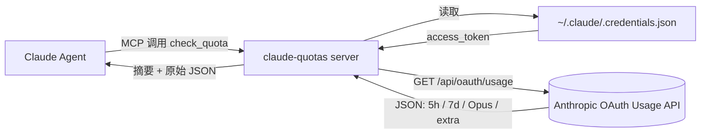

<div align="center">


<br />

<p>
  <a href="https://github.com/FruityMaxine/claude-quotas/stargazers"></a>
  <a href="https://github.com/FruityMaxine/claude-quotas/releases"></a>
  <a href="./LICENSE"></a>
  
  
</p>

<p>
  <a href="#-快速上手"><b>快速上手</b></a>
  &nbsp;·&nbsp;
  <a href="#-工作原理"><b>工作原理</b></a>
  &nbsp;·&nbsp;
  <a href="#-警觉策略"><b>警觉策略</b></a>
  &nbsp;·&nbsp;
  <a href="#-与同类工具的关系"><b>生态位</b></a>
  &nbsp;·&nbsp;
  <a href="#-常见问题"><b>常见问题</b></a>
  &nbsp;·&nbsp;
  <a href="./README.md"><b>English</b></a>
</p>

<br />

<p><i>一个 Claude Code 插件，给 Claude 一个查询自身订阅额度的 MCP 工具，并配套一份在长任务中主动监测、触限前优雅收尾、用 ScheduleWakeup 跳过 5 小时窗口重置的策略。</i></p>

</div>

---

## ✨ 项目背景

Claude Code 同时存在两条滚动额度限制：**5 小时会话窗口** 与 **7 天周封顶**。任何一条被触发，当前会话立即中断，正在进行的任务会停在中间状态。

当前 Claude Code 仅向用户暴露用量信息（在客户端界面查看），**Claude Agent 自身在执行任务时无法读取自己的额度状态**，因此也无法基于剩余额度调整执行策略。

`claude-quotas` 通过两件事补齐这个空缺：

1. **MCP 工具 `check_quota`**——Claude 在任务执行过程中可主动调用，获取所有窗口的实时利用率。
2. **配套 SKILL 策略**——规定 Claude 何时取基线、何时复查、何时进入警觉模式、何时通过 `ScheduleWakeup` 跳过 5 小时窗口的重置点。

## 🎯 功能列表

- 🧠 **任务期主动自检** — Claude 在多步任务执行中持续读取自身用量。
- 🛡️ **三段式警觉策略** — 基线、警觉、Sleep+收尾，每段对应明确动作。
- 💤 **ScheduleWakeup 跨重置** — 在分档 sleep 阈值触发后，Claude 完成最小可编译单位、commit 检查点、写恢复笔记，然后调用 `ScheduleWakeup` 跳过窗口重置；单段 1 小时上限会自动接力。
- 🤖 **`/loop` 场景额外严格** — 自动化任务下用户可能不在电脑前，触墙弹窗会永久阻塞循环；插件在检测到 loop 上下文时将 sleep 阈值提前 1%。
- 📊 **覆盖全部窗口** — 5 小时会话、7 天周窗口、Opus 周窗口、Sonnet 周窗口、按量计费额外用量。
- 🚦 **分档阈值** — Pro / Max 5x / Max 20x 各自的警觉与 Sleep 触发线，与各档位真实容量成比例。
- 🔁 **双窗口仲裁** — 5 小时与 7 天为两个独立上限，任意一个被触发都会中断；策略每次取剩余更紧的那个执行。
- 🪪 **细分档位识别** — Anthropic API 仅返回 `pro` / `max`；插件读取本地凭证 `rate_limit_tier` 字段还原 `max_5x` / `max_20x`。
- 🔐 **零额外凭证** — 复用 Claude Code 现有 OAuth 凭证（`~/.claude/.credentials.json`），无需另外登录。
- 📦 **单文件分发** — 用 esbuild 预打包，安装时无需 `npm install`。
- 🛒 **市场即装即用** — 仓库自带 `marketplace.json`，两条命令完成安装。

## ⚡ 快速上手

```bash
# 在任意 Claude Code 会话中执行
/plugin marketplace add FruityMaxine/claude-quotas
/plugin install claude-quotas@claude-quotas
```

安装完成后，Claude 获得 `check_quota` 工具，并自动加载警觉策略 SKILL。在新会话中表现为：

- 接到看起来需要多步执行的任务时，Claude 会先取一次**基线读数**。
- 在执行过程中按消耗速率**周期性复查**。
- 进入对应档位的**警觉区**后，调整子任务规模、提高复查频率。
- 进入**Sleep+收尾区**后，完成当前最小可编译单位、提交检查点、写恢复笔记、调用 `ScheduleWakeup` 跨过 5 小时窗口的重置点。
- 在 `/loop` 自动化场景下，sleep 阈值额外提前 1%。

也可以直接询问当前额度，例如 *"我这周还剩多少?"*，Claude 会主动调用工具并回答。

## 📺 工具返回示例

```text
5-hour session: 38% used | resets in 2h 15m
7-day weekly:   87% used | resets in 3d 4h
Plan:           max 5x
```

除了上面这段人类可读摘要，工具同时返回完整 JSON：`utilization` 百分比、`resets_at` ISO 8601 时间戳、`subscription_type` 粗档位、`rate_limit_tier` 细档位、各模型独立窗口、`extra_usage` 额外用量。

## 🛠️ 安装方式

<details>
<summary><b>方式 A — 通过插件市场（推荐）</b></summary>

```bash
/plugin marketplace add FruityMaxine/claude-quotas
/plugin install claude-quotas@claude-quotas
```

两条命令完成。后续 `/plugin marketplace update` 可拉取新版本。

</details>

<details>
<summary><b>方式 B — 直接从 GitHub 安装单个插件</b></summary>

```bash
/plugin install github:FruityMaxine/claude-quotas
```

跳过市场环节，仅安装本插件。

</details>

<details>
<summary><b>方式 C — 本地开发模式</b></summary>

```bash
git clone https://github.com/FruityMaxine/claude-quotas.git
cd claude-quotas
npm install && npm run build
claude --plugin-dir ./
```

`--plugin-dir` 让 Claude Code 直接从硬盘加载插件，方便在 `src/index.ts` 修改后即时验证。

</details>

## 🔍 工作原理



1. 插件启动一个 MCP server，对外暴露 `check_quota` 一个工具。
2. 工具被调用时，server 从本地凭证文件读取 `accessToken`。该文件由 `claude login` 在登录时写入。
3. 使用 `anthropic-beta: oauth-2025-04-20` 头部访问 `GET https://api.anthropic.com/api/oauth/usage`。该接口未公开记录于官方文档，但是 Claude Code 客户端自身使用的同一接口。
4. 将返回数据整理为人类可读摘要与结构化 JSON 两份返回。

> 整个流程不引入新凭证、不读写额外配置、不做任何遥测。Token 仅在本机与 `api.anthropic.com` 之间传输。

## 🛡️ 警觉策略

策略以 `utilization`（已用百分比）为唯一判定指标，按订阅档位分档。

### 5 小时窗口

| 计划 | 警觉区 | Sleep + 收尾区 |
|:---- |:------ |:-------------- |
| **Pro**     | `utilization ≥ 70%` | `utilization ≥ 95%` |
| **Max 5x**  | `utilization ≥ 94%` | `utilization ≥ 98%` |
| **Max 20x** | `utilization ≥ 95%` | `utilization ≥ 99%` |

### 7 天窗口

| 计划 | 警觉区 | 收尾后停止区（不睡） |
|:---- |:------ |:-------------------- |
| **Pro**     | `utilization ≥ 95%` | `utilization ≥ 99%` |
| **Max 5x**  | `utilization ≥ 98%` | `utilization ≥ 99.5%` |
| **Max 20x** | `utilization ≥ 98%` | `utilization ≥ 99.5%` |

> 7 天窗口的重置间隔以天计，无法通过 ScheduleWakeup 跳过；触发停止区时插件会完成收尾、写恢复笔记，并向用户报告，由用户决定后续处理。

### Sleep + 收尾区触发后的执行序列

5 小时窗口越过 sleep 阈值时，Claude 按以下顺序执行，然后结束当前 turn：

1. **完成当前最小可编译单位**。不留半截 function、未闭合括号、缺失的 import。在不破坏可编译状态的前提下，尽量完成更大的单位。
2. **`git commit` 一个检查点**。不执行 push（push 涉及共享状态，需要用户授权）。
3. **写恢复笔记** 到 `docs/progress/quota-resume.md`：任务摘要、已完成子任务、下一个待办子任务（精确到文件路径与行号）、未落地的设计决策。
4. **调用 `ScheduleWakeup`**，`delaySeconds = 距离 5 小时窗口重置的秒数`。runtime 单段上限 3600 秒，超过时通过接力睡（最多 6 段）补齐。

### 双窗口仲裁

每次复查同时评估 5 小时与 7 天两个窗口，按剩余更紧的那个走对应分支。特殊规则：当 7 天窗口位于停止区时，**禁止 sleep**；因为 ScheduleWakeup 无法跨过天级重置。

### `/loop` 场景

`/loop` 自动化任务通常意味着用户不在电脑前。触墙后 Claude Code 弹出的"使用付费额度或等待重置"对话框**不会因额度恢复而自动消失**，导致循环永久阻塞。为规避这种情形，SKILL 在检测到 loop 上下文时将每个 sleep 阈值提前 1% 触发。

完整策略与执行细节见 [`skills/check-quota/SKILL.md`](./skills/check-quota/SKILL.md)。

## 🤝 与同类工具的关系

Claude Code 周边已经有几个成熟的用量观测工具，它们解决的是另一个方向的问题：

- [**ccusage**](https://github.com/ryoppippi/ccusage)（约 13.6k ⭐）—— CLI 工具，离线解析 Claude Code 本地 JSONL 转录文件，输出按日 / 月 / 会话维度的 token 数与美元成本报告。
- [**Claude-Code-Usage-Monitor**](https://github.com/Maciek-roboblog/Claude-Code-Usage-Monitor)（约 7.9k ⭐）—— 终端实时监控，带预测和警告。

这两个项目的目标是**让用户清晰地看到自己的用量**，便于做规划。**`claude-quotas` 不做这些事**：它没有 statusline 渲染、没有按日报告、没有成本分析、没有趋势预测、没有菜单栏应用。这些方向上述项目做得更好。

本插件做的是另一件事：让 **Claude Agent 自身**在多步任务中读取自己的额度，并按策略在触墙前完成收尾、提交检查点、用 ScheduleWakeup 跨过 5 小时窗口的重置点。这是给 Agent 用的工具，不是给用户看的仪表盘。

因此三者实际上是互补关系，而不是替代：

- 想看历史用量与成本核算 → `ccusage`
- 想要实时仪表盘 → `Claude-Code-Usage-Monitor`
- 想让 Agent 在长任务中自己管预算并跨过重置点 → `claude-quotas`

## 🧩 工具返回字段

| 字段 | 类型 | 说明 |
|:---- |:---- |:---- |
| `subscription_type` | `string` | API 返回的粗档位：`pro` 或 `max`。 |
| `rate_limit_tier` | `string \| null` | 本地凭证里的细档位，例如 `default_claude_max_5x` / `default_claude_max_20x`。区分 Max 5x 与 Max 20x 必须读取此字段。 |
| `five_hour.utilization` | `number` (0–100) | 5 小时窗口已用百分比。 |
| `five_hour.resets_at` | `string` (ISO 8601) | 5 小时窗口下次重置时间。 |
| `seven_day.utilization` | `number` (0–100) | 7 天周窗口已用百分比。 |
| `seven_day.resets_at` | `string` (ISO 8601) | 7 天周窗口下次重置时间。 |
| `seven_day_opus` | `object \| null` | Opus 专用 7 天窗口。返回 `null` 通常表示该账号未暴露此池；返回 `{utilization: 0, resets_at: null}` 这种 dormant 形态表示池存在但本周期未消耗。 |
| `seven_day_sonnet` | `object \| null` | Sonnet 专用 7 天窗口。返回 `null` 通常表示该账号未暴露此池；返回 `{utilization: 0, resets_at: null}` 这种 dormant 形态表示池存在但本周期未消耗。 |
| `extra_usage` | `object \| null` | 按量计费额外预算状态。 |
| `summary` | `string` | 多行人类可读摘要。 |

## 🔐 隐私与安全

- 仅读取本地 `~/.claude/.credentials.json`（或 `$CLAUDE_CONFIG_DIR` 指向的目录）。
- 单次出网请求，目标 `api.anthropic.com`，路径与 Claude Code 客户端自身使用的相同。
- 无缓存、无日志、无任何遥测或第三方上报。
- 全部源码约 150 行 TypeScript，参见 [`src/index.ts`](./src/index.ts)。

## ❓ 常见问题

**Q：为什么提供 MCP 工具而不是用户界面？**
Claude Code 客户端已经向用户提供了用量界面。本插件填补的是 Claude Agent 自身在任务执行中无法读取额度的空白，因此设计为 MCP 工具，由 Agent 主动调用。

**Q：使用的是公开 API 吗？**
否。`/api/oauth/usage` 接口当前未在官方文档中记录，但是 Claude Code 客户端自身使用的同一接口，稳定性可参考。如未来 Anthropic 提供官方接口，本插件会迁移过去。

**Q：本地凭证会被外发吗？**
不会。Token 仅在 TLS 上传输至 `api.anthropic.com`，路径与 Claude Code 日常通信完全相同，不经过任何第三方。

**Q：Token 过期了会发生什么？**
工具返回非阻塞的提示信息，SKILL 指示 Claude 在用户未明确请求时静默跳过。当用户主动请求查询额度时才会看到该错误。Token 刷新通过 `claude login` 完成。

**Q：Claude 在工作时会反复弹出额度提醒吗？**
不会。SKILL 规定只在阈值越线时采取动作，不发表评论。警觉区最多附带一句切换提示；Sleep + 收尾区触发后，收尾过程本身即是行为说明。

**Q：`ScheduleWakeup` 没生效怎么办？**
收尾流程包含三件套：commit、恢复笔记、ScheduleWakeup。即便 wake-up 因系统重启或会话终止未能触发，干净的 commit 与 `docs/progress/quota-resume.md` 仍然提供了可恢复的状态——下次会话中告知 Claude "继续上次进度" 即可。Wake-up 是优化项而非单点。

**Q：能否调整阈值或行为？**
全部策略写在 [`skills/check-quota/SKILL.md`](./skills/check-quota/SKILL.md) 中，编辑该文件即可修改阈值表、收尾步骤、loop 收紧规则等。修改后需要在新会话中生效。

**Q：摘要里显示 `Plan: max`，但我实际是 Max 5x？**
API 仅返回粗档位 `pro` / `max`。插件会读取本地凭证 `rate_limit_tier` 字段恢复细档位，摘要中显示的是 `max 5x` / `max 20x` 等精确值。

## 🗺️ 路线图

- [ ] 可配置阈值的通知 hook（越线时主动 push）
- [ ] 摘要本地化（JSON 已通用，仅人类可读摘要为英文）
- [ ] 通过 `${CLAUDE_PLUGIN_DATA}` 持久化每个项目的用量历史
- [ ] 增加供用户调用的斜杠命令 `/quota`

欢迎提交 PR，详见下一节。

## 🤝 参与贡献

Issue、设计讨论、PR 均欢迎。

```bash
git clone https://github.com/FruityMaxine/claude-quotas.git
cd claude-quotas
npm install
npm run typecheck
npm run build
claude --plugin-dir ./
```

主要逻辑集中在单个 TypeScript 文件，策略集中在一份 SKILL.md。代码改动通常较小，策略调整为主。

## 📜 协议

[MIT](./LICENSE) © [FruityMaxine](https://github.com/FruityMaxine)

## 👤 作者

由 [FruityMaxine](https://github.com/FruityMaxine) 编写。如果本项目对你有帮助，欢迎 Star 关注后续更新。

---

<sub>**关键词**：claude code, claude code plugin, claude code mcp, claude code rate limit, claude code 5 hour limit, claude code weekly limit, claude code quota, claude code auto resume, claude code schedule wakeup, claude code /loop, claude code vigilance, anthropic oauth usage api, claude-quotas marketplace</sub>
