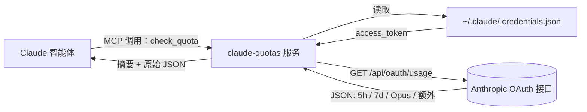

<div align="center">


<br />

<p>
  <a href="https://github.com/FruityMaxine/claude-quotas/stargazers"></a>
  <a href="https://github.com/FruityMaxine/claude-quotas/releases"></a>
  <a href="./LICENSE"></a>
  
  
</p>

<p>
  <a href="#-快速上手"><b>快速上手</b></a>
  &nbsp;·&nbsp;
  <a href="#-工作原理"><b>原理</b></a>
  &nbsp;·&nbsp;
  <a href="#-预警阈值"><b>预警阈值</b></a>
  &nbsp;·&nbsp;
  <a href="#-常见问题"><b>常见问题</b></a>
  &nbsp;·&nbsp;
  <a href="./README.md"><b>English</b></a>
</p>

<br />

<p><i>一个 Claude Code 插件，给 Claude 装上"自查额度"的能力。它能在长任务开工前提醒你额度告急，而不是等任务卡死在 99% 才哭。</i></p>

</div>

---

## ✨ 为什么要做这个

Claude Code 同时跑着两条滚动额度线：**5 小时会话窗口** 和 **7 天周封顶**。任何一条触顶，会话立刻断流——重构做了一半、对话戛然而止、心流彻底崩盘。

问题在于：当下唯一能看见剩余额度的，是用户你自己——通过 Claude Code 的界面查。**真正在干活的 Claude 自己反而完全看不到这条墙。** 它不知道自己离崩盘还有多远，自然也没法主动调整节奏。

`claude-quotas` 就是来填这个信息差的。它给 Claude 加了一个 MCP（Model Context Protocol）工具,Claude 在多步任务里**会主动警觉地用它**:任务开始时取个基线读数,执行过程中按消耗速率定期复查,一旦触到分档阈值就**优雅收尾、commit 检查点、用 `ScheduleWakeup` 睡过额度重置**——而不是直接撞墙把工作停在半截。

> **一句话**:给 Claude 装上"看见自己额度"的眼睛 + "撑过额度重置"的纪律,而不是死在你重构进行到一半。

## 🎯 功能亮点

- 🧠 **任务期主动自检** — Claude 在多步任务的执行过程中持续读取自己的用量,不再是只有你问才看。
- 🛡️ **主动警觉而非沉默** — 不是"默认沉默",也不是"啥事都报告",而是**有节制地警觉**:基线、复查、按阈值采取具体动作。
- 💤 **自动睡过去额度墙** — 触发分档 sleep 阈值时,Claude 会**收尾当前最小完整单位、commit 检查点、写恢复笔记、用 `ScheduleWakeup` 接力睡过 5 小时窗口的重置**(单段最长 1 小时,会自动接力)。等你回来时,工作要么已经完成、要么干净停在了下一个子任务前。
- 🤖 **`/loop` 场景特别处理** — 知道自动循环里你不在电脑前、被中断的代价更大,所以在 loop 上下文会**额外收紧 1% 安全余量**。
- 📊 **覆盖每个窗口** — 5 小时会话、7 天周封顶、Opus 周专用、Sonnet 周专用、按量计费额外用量。
- 🚦 **分档阈值** — Pro 70% 进警觉、Max 5x 94% 进警觉、Max 20x 95% 进警觉(5 小时窗口),与各档位的真实消耗节奏成比例。
- ⏱️ **"哪个窗口先到上限谁说了算"** — 5 小时和 7 天是两条独立的天花板,任何一个先满都会触发中断,策略永远盯着两个、按更严的那个走。
- 🪪 **细分档位识别** — API 只返回粗粒度的 `pro` / `max`,插件读本地凭证 `rate_limit_tier` 字段,精确还原 `max_5x` / `max_20x`。
- 🔐 **零额外登录** — 直接复用 `~/.claude/.credentials.json` 里现成的 OAuth 凭证。
- 📦 **单文件分发** — 用 esbuild 预打包,安装后无需 `npm install`。
- 🛒 **市场即装即用** — 仓库自带 `marketplace.json`,两条斜杠命令完事。

## ⚡ 快速上手

```bash
# 在任意 Claude Code 会话里执行
/plugin marketplace add FruityMaxine/claude-quotas
/plugin install claude-quotas@claude-quotas
```

完事。Claude 现在多了一个 `check_quota` 工具,以及一份警觉策略 SKILL。从此往后:

- 接到**任何看起来不止一步**的任务,Claude 会先取一次**基线读数**。
- 工作过程中**周期性复查**,按当前消耗速率自行调整频率。
- 触到你这档的**警觉区**就提高警惕(挑小一点的子任务做、不开新大头)。
- 触到你这档的**Sleep 区**会**优雅收尾、commit 检查点、写恢复笔记、`ScheduleWakeup` 接力睡过额度重置**。
- 在 `/loop` 自动化场景下,会**额外收紧 1% 安全余量**(因为人不在电脑前)。

你也可以随时直接问:*"我这周还剩多少?"*——Claude 会调工具直接告诉你。

## 📺 你（和 Claude）能看到什么

```text
5-hour session: 38% used | resets in 2h 15m
7-day weekly:   87% used | resets in 3d 4h
Plan:           max 5x
```

除了这段易读摘要，工具还会回一份完整 JSON：`utilization` 百分比、`resets_at` ISO 8601 时间戳、`subscription_type` 粗档位、`rate_limit_tier` 细档位、各模型独立窗口、`extra_usage` 额外用量等等，方便 Claude 拿来做条件判断。

## 🛠️ 安装姿势

<details>
<summary><b>姿势 A — 通过插件市场（推荐）</b></summary>

```bash
/plugin marketplace add FruityMaxine/claude-quotas
/plugin install claude-quotas@claude-quotas
```

两条命令搞定，无需手动克隆。后续 `/plugin marketplace update` 一键拉新版本。
</details>

<details>
<summary><b>姿势 B — 直接从 GitHub 装单插件</b></summary>

```bash
/plugin install github:FruityMaxine/claude-quotas
```

跳过市场环节，适合"我就只想要这一个插件"的场景。
</details>

<details>
<summary><b>姿势 C — 本地开发模式</b></summary>

```bash
git clone https://github.com/FruityMaxine/claude-quotas.git
cd claude-quotas
npm install && npm run build
claude --plugin-dir ./
```

`--plugin-dir` 标志让 Claude Code 直接从硬盘加载插件，方便你改 `src/index.ts` 后即时验证。
</details>

## 🔍 工作原理



1. 插件起一个 MCP 服务（叫 `claude-quotas`），对外只暴露一个工具 `check_quota`。
2. Claude 调用时，服务从本地凭证文件读 `accessToken`——这文件是你 `claude login` 时 Claude Code 自己写下的。
3. 用 `anthropic-beta: oauth-2025-04-20` 头部去打 `GET https://api.anthropic.com/api/oauth/usage`（这接口未公开但稳定，是 Claude Code 自己也在用的那个）。
4. 把返回的原始数据整理成两份：一份人话摘要 + 一份结构化 JSON，回给 Claude。

> **没有新凭证、没有新配置、不收任何遥测。** Token 不出本机；唯一的外网请求就是访问 `api.anthropic.com`。

## 🛡️ 警觉而非沉默

市面上大部分"额度追踪器"插件死在两种极端:**太殷勤**(定时轮询、73% 涨 74% 都要打断你播报)或者**太被动**(直到撞墙才发现额度满了)。这个插件追求的是**有节制的警觉**:具体阈值对应具体动作。

### 三段区间

SKILL 按 `utilization`(已用百分比)分档,每个 plan 有自己的两条线:

#### 5 小时窗口

| 计划 | 警觉区 | Sleep + 收尾区 |
|:---- |:------ |:-------------- |
| **Pro**     | `utilization ≥ 70%` | `utilization ≥ 95%` |
| **Max 5x**  | `utilization ≥ 94%` | `utilization ≥ 98%` |
| **Max 20x** | `utilization ≥ 95%` | `utilization ≥ 99%` |

#### 7 天窗口

| 计划 | 警觉区 | 收尾后 STOP 区(不睡) |
|:---- |:------ |:------------------- |
| **Pro**     | `utilization ≥ 95%` | `utilization ≥ 99%` |
| **Max 5x**  | `utilization ≥ 98%` | `utilization ≥ 99.5%` |
| **Max 20x** | `utilization ≥ 98%` | `utilization ≥ 99.5%` |

> 7 天窗口的重置以"天"计,睡不过去。所以触到 STOP 区时 Claude 会先收尾、写恢复笔记,然后**告诉你**(而不是去尝试睡)。

### Sleep 区(5h)触发后会发生什么

5 小时窗口越线后,Claude 会**按顺序做完下面四件**,然后结束当前 turn:

1. **收尾当前最小完整单位**。绝不留半截 function、未闭合括号、缺失 import。**贪心地把额度用满做出最大完整单位**——但代码必须保持可编译。
2. **`git commit` 一个检查点**(不会 push——push 是共享操作,需要你授权)。
3. **写恢复笔记** `docs/progress/quota-resume.md`:任务摘要、已完成子任务、**下一个具体子任务**(精确到文件路径和行号)、未落地的设计决策。
4. **`ScheduleWakeup`** 调用,`delaySeconds = 距离重置的秒数`(单段被 runtime 限制在 3600 秒上限)。醒来后再 check 一次,如果窗口还没重置就接力再睡一段(最多 6 段)。

等你回来时,要么任务已完成、要么干净地停在下一个子任务前——绝不会卡在半截代码加一个"用付费额度还是等待"的弹窗上。

### 哪个窗口先满谁说了算

5 小时和 7 天是两条独立的天花板——**任意一条触限就被砍**。所以策略每次复查都看**两个**窗口、按**更严**的那个走。特例:7 天进了 STOP 区时,**禁止 sleep**——因为 sleep 几小时救不了天级窗口。

### `/loop` 场景特别处理

自动化 `/loop` 通常意味着用户离开了电脑。撞墙会弹一个**额度重置后也不会自动消失**的对话框——意味着 loop 实际死了,要等你人工回来点。为了规避这个,SKILL 在 loop 上下文里把每个 sleep 阈值**提前 1%** 触发。多花 1% 余量 vs 整夜的 loop 全废,显然前者划算。

想改策略?所有阈值和行为规则都在 [`skills/check-quota/SKILL.md`](./skills/check-quota/SKILL.md) 这一份纯英文文档里,改完即生效。

## 🧩 工具返回的字段

| 字段 | 类型 | 说明 |
|:---- |:---- |:---- |
| `subscription_type` | `string` | API 返回的粗档位：`pro` 或 `max` |
| `rate_limit_tier` | `string \| null` | 本地凭证里的细档位，例如 `default_claude_max_5x` / `default_claude_max_20x`。要区分 Max 5x 和 Max 20x 必须看这个字段——API 自己分不清。 |
| `five_hour.utilization` | `number` (0–100) | 5 小时窗口已用百分比 |
| `five_hour.resets_at` | `string` (ISO 8601) | 5 小时窗口下次重置时间 |
| `seven_day.utilization` | `number` (0–100) | 7 天周额度已用百分比 |
| `seven_day.resets_at` | `string` (ISO 8601) | 7 天周窗口下次重置时间 |
| `seven_day_opus` | `object \| null` | Opus 专用 7 天窗口；档位没有独立 Opus 配额时为 `null` |
| `seven_day_sonnet` | `object \| null` | Sonnet 专用 7 天窗口；多数档位下未激活（utilization 0、resets_at null） |
| `extra_usage` | `object \| null` | 按量计费的额外预算状态 |
| `summary` | `string` | 拼好的多行人话摘要 |

## 🔐 隐私与安全

- **只读**本地 `~/.claude/.credentials.json`（或 `CLAUDE_CONFIG_DIR` 指向的目录）。
- **只发**一次外网请求，目标 `api.anthropic.com`，跟 Claude Code 自己发的请求一模一样。
- **不存**任何东西——没有缓存、没有日志文件、没有用量追踪。
- 全部源码大约 150 行 TypeScript，一杯咖啡就能审完，参见 [`src/index.ts`](./src/index.ts)。

## ❓ 常见问题

**Q：为什么不做个 UI 给我看，反而做个工具给 Claude？**
因为 Claude Code 的 UI 已经能让你看了。**真正瞎着的是 Claude 自己**——它干活，但它看不见自己消耗了多少。这个插件补的就是这条空缺。

**Q：用的是公开 API 吗？**
不是。OAuth 用量接口未公开，但它是 Claude Code 自己也在用的接口，所以稳定性靠谱。如果哪天 Anthropic 推了官方版本，这个插件会迁移过去。

**Q：我的凭证会泄露吗？**
不会。Token 只在 TLS 上发往 `api.anthropic.com`，路径与 Claude Code 日常通信完全相同，无任何第三方中转。

**Q:Token 过期了怎么办?**
工具返回一条非阻塞提示,SKILL 指示 Claude **静默跳过**、不打断你正在做的事。只有你主动让查额度时才会看到错误。Token 刷新交给 `claude login`,什么时候方便什么时候来。

**Q:Claude 工作时会不会一直蹦出来报告额度?**
不会。**警觉 ≠ 噪音**。Claude 默默取基线、默默复查,只在触到阈值区时**采取动作**(不是发评论)。警觉区最多一句切换提示;Sleep 区触发后,收尾流程本身就是说明,不需要额外解释。

**Q:`ScheduleWakeup` 没生效怎么办?**
所以收尾流程是**三件套**:commit + 恢复笔记 + ScheduleWakeup。即便 wake-up 因为某些原因没起来(系统重启、session 结束等),你还有干净的 commit 和 `docs/progress/quota-resume.md` 兜底——回话时一句"接着上次的继续"就能恢复。Wake-up 是优化,不是单点。

**Q:想要不同阈值 / 不同行为?**
所有策略都在 [`skills/check-quota/SKILL.md`](./skills/check-quota/SKILL.md) 一份纯英文里。改阈值表、改收尾步骤、关掉 loop 收紧,都直接编辑即生效——对 fork 友好。

**Q:明明是 Max 5x,为啥摘要里写 `Plan: max`?**
API 只返回粗粒度的 `pro` / `max`。插件会读你本地 `~/.claude/.credentials.json` 的 `rate_limit_tier` 字段,恢复精确档位(`max_5x` / `max_20x`),摘要里展示的就是细档位。

## 🗺️ 路线图

- [ ] 可配置阈值的通知 hook（越线时主动 push）
- [ ] 摘要本地化（JSON 是通用的，目前只有那行人话摘要是英文）
- [ ] 用 `${CLAUDE_PLUGIN_DATA}` 持久化每个项目的用量历史
- [ ] 加一个供人类用的斜杠命令 `/quota`

欢迎 PR，详见下一节。

## 🤝 参与贡献

Issue、想法、PR 都欢迎。

```bash
git clone https://github.com/FruityMaxine/claude-quotas.git
cd claude-quotas
npm install
npm run typecheck
npm run build
claude --plugin-dir ./
```

整个插件就一个 TypeScript 文件。会读 JSON、会写正则，就能在这里发 feature。

## 📜 协议

[MIT](./LICENSE) © [FruityMaxine](https://github.com/FruityMaxine)

## 👤 作者

由 **[FruityMaxine](https://github.com/FruityMaxine)** 编写——因为眼睁睁看一段 30 分钟的重构在 99% 利用率上猝死，比从头不开工还痛苦。

<div align="center">

<br />

<sub>如果这玩意救过你一个 session，欢迎在仓库点个 ⭐ —— 这是说声谢谢最便宜的方式。</sub>

</div>
