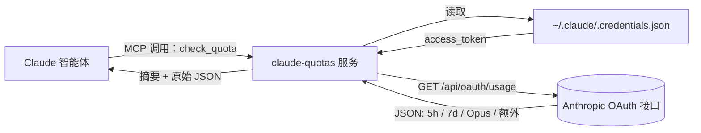

<div align="center">


<br />

<p>
  <a href="https://github.com/FruityMaxine/claude-quotas/stargazers"></a>
  <a href="https://github.com/FruityMaxine/claude-quotas/releases"></a>
  <a href="./LICENSE"></a>
  
  
</p>

<p>
  <a href="#-快速上手"><b>快速上手</b></a>
  &nbsp;·&nbsp;
  <a href="#-工作原理"><b>原理</b></a>
  &nbsp;·&nbsp;
  <a href="#-预警阈值"><b>预警阈值</b></a>
  &nbsp;·&nbsp;
  <a href="#-常见问题"><b>常见问题</b></a>
  &nbsp;·&nbsp;
  <a href="./README.md"><b>English</b></a>
</p>

<br />

<p><i>一个 Claude Code 插件，给 Claude 装上"自查额度"的能力。它能在长任务开工前提醒你额度告急，而不是等任务卡死在 99% 才哭。</i></p>

</div>

---

## ✨ 为什么要做这个

Claude Code 同时跑着两条滚动额度线：**5 小时会话窗口** 和 **7 天周封顶**。任何一条触顶，会话立刻断流——重构做了一半、对话戛然而止、心流彻底崩盘。

问题在于：当下唯一能看见剩余额度的，是用户你自己——通过 Claude Code 的界面查。**真正在干活的 Claude 自己反而完全看不到这条墙。** 它不知道自己离崩盘还有多远，自然也没法主动调整节奏。

`claude-quotas` 就是来填这个信息差的。它是一个 MCP（Model Context Protocol）工具，让 Claude 自己就能调用 Anthropic 的 OAuth 用量接口，拿到所有窗口的实时利用率。装上之后 Claude 就能：

- 接到长任务时**先看看预算够不够**，
- 越过分级阈值时主动报警，
- 看到墙近了，建议你拆分、缓冲或者干脆等重置。

> **一句话**：让 Claude 别把自己开下悬崖。

## 🎯 功能亮点

- 🧠 **自检模式** — Claude 自己想查就能查，不用人类掺和。
- 📊 **四维额度** — 5 小时会话、7 天周额度、7 天 Opus 专用、按量计费的额外用量，全包。
- ⏱️ **重置倒计时** — 每个窗口都附带 "2h 15m 后重置" 这种人话格式。
- 🪪 **分级阈值** — 内置 `pro`、`max_5x`、`max_20x` 三档差异化告警逻辑。
- 🔐 **零额外登录** — 直接复用 `~/.claude/.credentials.json` 里现成的 OAuth 凭证。
- 📦 **单文件分发** — 用 esbuild 预打包，安装后无需 `npm install`。
- 🛒 **市场即装即用** — 仓库自带 `marketplace.json`，两条斜杠命令完事。

## ⚡ 快速上手

```bash
# 在任意 Claude Code 会话里执行
/plugin marketplace add FruityMaxine/claude-quotas
/plugin install claude-quotas@claude-quotas
```

完事。Claude 现在多了一个 `check_quota` 工具。你可以直接问：

> *"我这周还剩多少额度？"*

Claude 会自动调用工具、整理结果。或者更狠一点，告诉 Claude **每次开始多步任务前都先查一次** `check_quota`。

## 📺 你（和 Claude）能看到什么

```text
5-hour session: 38% used | resets in 2h 15m
7-day weekly:   87% used | resets in 3d  4h
7-day Opus:     12% used | resets in 3d  4h
Subscription:   max_5x
```

除了这段易读摘要，工具还会回一份完整 JSON：`utilization` 百分比、`resets_at` ISO 8601 时间戳、`subscription_type` 订阅档位、`extra_usage` 额外用量等等，方便 Claude 直接拿来做条件判断。

## 🛠️ 安装姿势

<details>
<summary><b>姿势 A — 通过插件市场（推荐）</b></summary>

```bash
/plugin marketplace add FruityMaxine/claude-quotas
/plugin install claude-quotas@claude-quotas
```

两条命令搞定，无需手动克隆。后续 `/plugin marketplace update` 一键拉新版本。
</details>

<details>
<summary><b>姿势 B — 直接从 GitHub 装单插件</b></summary>

```bash
/plugin install github:FruityMaxine/claude-quotas
```

跳过市场环节，适合"我就只想要这一个插件"的场景。
</details>

<details>
<summary><b>姿势 C — 本地开发模式</b></summary>

```bash
git clone https://github.com/FruityMaxine/claude-quotas.git
cd claude-quotas
npm install && npm run build
claude --plugin-dir ./
```

`--plugin-dir` 标志让 Claude Code 直接从硬盘加载插件，方便你改 `src/index.ts` 后即时验证。
</details>

## 🔍 工作原理



1. 插件起一个 MCP 服务（叫 `claude-quotas`），对外只暴露一个工具 `check_quota`。
2. Claude 调用时，服务从本地凭证文件读 `accessToken`——这文件是你 `claude login` 时 Claude Code 自己写下的。
3. 用 `anthropic-beta: oauth-2025-04-20` 头部去打 `GET https://api.anthropic.com/api/oauth/usage`（这接口未公开但稳定，是 Claude Code 自己也在用的那个）。
4. 把返回的原始数据整理成两份：一份人话摘要 + 一份结构化 JSON，回给 Claude。

> **没有新凭证、没有新配置、不收任何遥测。** Token 不出本机；唯一的外网请求就是访问 `api.anthropic.com`。

## 🚦 预警阈值

SKILL 文档指导 Claude 在不同档位下采取不同的报警门槛：

| 订阅档位 | 报警起点 | 安全余量 |
|:-------- |:-------- |:--------|
| `pro`    | ≥ 80%    | ≤ 20%   |
| `max_5x` | ≥ 96%    | ≤ 4%    |
| `max_20x`| ≥ 98%    | ≤ 2%    |

为啥三档不一样？因为 Pro 档总盘子小，剩 20% 可能一次大重构就吃完；而 Max 20x 每个百分点对应的实际预算大约是 Pro 的 5 倍——同样剩 5%，对 Max 20x 来说还很从容，没必要早早惊叫。

## 🧩 工具返回的字段

| 字段 | 类型 | 说明 |
|:---- |:---- |:---- |
| `subscription_type` | `string` | 订阅档位，`pro` / `max_5x` / `max_20x` 等 |
| `five_hour.utilization` | `number` (0–100) | 5 小时窗口已用百分比 |
| `five_hour.resets_at` | `string` (ISO 8601) | 5 小时窗口下次重置时间 |
| `seven_day.utilization` | `number` (0–100) | 7 天周额度已用百分比 |
| `seven_day.resets_at` | `string` (ISO 8601) | 7 天周窗口下次重置时间 |
| `seven_day_opus` | `object \| null` | Opus 专用 7 天窗口（Max 档独有） |
| `extra_usage` | `object \| null` | 按量计费的额外预算状态 |
| `summary` | `string` | 拼好的多行人话摘要 |

## 🔐 隐私与安全

- **只读**本地 `~/.claude/.credentials.json`（或 `CLAUDE_CONFIG_DIR` 指向的目录）。
- **只发**一次外网请求，目标 `api.anthropic.com`，跟 Claude Code 自己发的请求一模一样。
- **不存**任何东西——没有缓存、没有日志文件、没有用量追踪。
- 全部源码大约 150 行 TypeScript，一杯咖啡就能审完，参见 [`src/index.ts`](./src/index.ts)。

## ❓ 常见问题

**Q：为什么不做个 UI 给我看，反而做个工具给 Claude？**
因为 Claude Code 的 UI 已经能让你看了。**真正瞎着的是 Claude 自己**——它干活，但它看不见自己消耗了多少。这个插件补的就是这条空缺。

**Q：用的是公开 API 吗？**
不是。OAuth 用量接口未公开，但它是 Claude Code 自己也在用的接口，所以稳定性靠谱。如果哪天 Anthropic 推了官方版本，这个插件会迁移过去。

**Q：我的凭证会泄露吗？**
不会。Token 只在 TLS 上发往 `api.anthropic.com`，路径与 Claude Code 日常通信完全相同，无任何第三方中转。

**Q：Token 过期了怎么办？**
工具会礼貌地报错，提示你跑一下 `claude login`。它不会替你刷新——刷新这事归 Claude Code 自己管。

**Q：能关掉那些报警阈值吗？**
能。阈值全部写在 [`skills/check-quota/SKILL.md`](./skills/check-quota/SKILL.md) 里，自由编辑、fork 或者整段删掉都行。

## 🗺️ 路线图

- [ ] 可配置阈值的通知 hook（越线时主动 push）
- [ ] 摘要本地化（JSON 是通用的，目前只有那行人话摘要是英文）
- [ ] 用 `${CLAUDE_PLUGIN_DATA}` 持久化每个项目的用量历史
- [ ] 加一个供人类用的斜杠命令 `/quota`

欢迎 PR，详见下一节。

## 🤝 参与贡献

Issue、想法、PR 都欢迎。

```bash
git clone https://github.com/FruityMaxine/claude-quotas.git
cd claude-quotas
npm install
npm run typecheck
npm run build
claude --plugin-dir ./
```

整个插件就一个 TypeScript 文件。会读 JSON、会写正则，就能在这里发 feature。

## 📜 协议

[MIT](./LICENSE) © [FruityMaxine](https://github.com/FruityMaxine)

## 👤 作者

由 **[FruityMaxine](https://github.com/FruityMaxine)** 编写——因为眼睁睁看一段 30 分钟的重构在 99% 利用率上猝死，比从头不开工还痛苦。

<div align="center">

<br />

<sub>如果这玩意救过你一个 session，欢迎在仓库点个 ⭐ —— 这是说声谢谢最便宜的方式。</sub>

</div>
